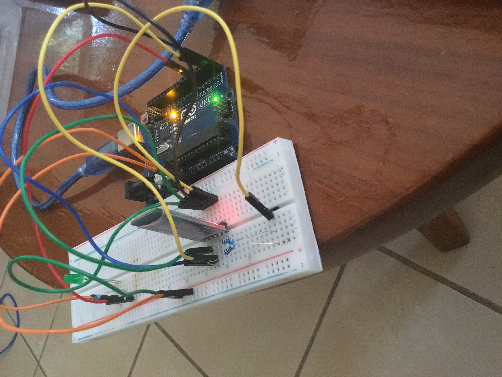
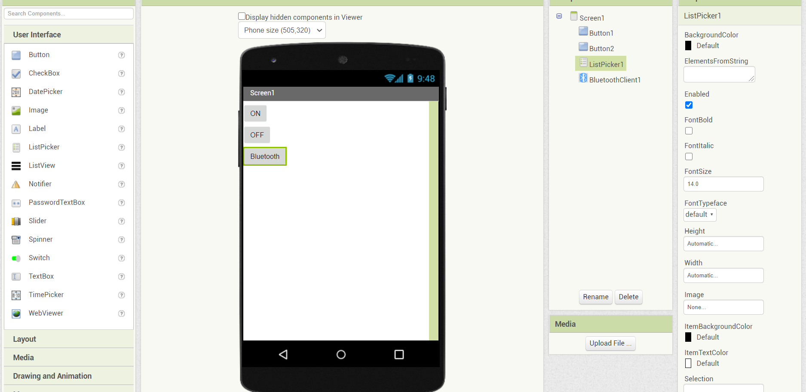

## What is Arduino?
Arduino is an open-source electronics platform based on easy-to-use hardware and software. Arduino boards are able to read inputs - light on a sensor, a finger on a button, or a Twitter message - and turn it into an output - activating a motor, turning on an LED, publishing something online.

## Brief
This repository contains the code of 4 mini projects made on Arduino. The physical structure of all the 4 projects will be explained through this [README.md](https://github.com/Annarhysa/Arduino-Projects/blob/main/README.md)

This is the list of all the projects in this repository 

1. Rain Detection Using Arduino And Raindrop Sensor
2. Gas Detection Using Arduino And Gas Sensor
3. LED Controlling System Using Arduino And Bluetooth Modules
4. Blinking of LED Using WiFi Mode (Node MCU)

## 1. Rain Detection Using Arduino And Raindrop Sensor
Rain sensor is one of the kind of switching device which is used to detect rainfall. It is a board on which nickel is used to coat lines on the board. It works on the principle of resistance. This module allows us to measure moisture via analog output pins and it provides a digital output when the threshold of moisture is crossed. As raindrops are collected on the circuit board, they create path of parallel resistance.

 

The sensor is a resistor dipole that shows less resistance when dry. When there are water droplets present, it reduces the resistance because water is a conductor of electricity and presence of water connects nickel lines in parallel, therby reducing resistance and volatge drop across it.\
We have used the Arduino IDE to code the Arduino and setting the threshold for the rain sensor. The circuit diagram for the same is as follows:

 

 

## 2. Gas Detection Using Arduino And Gas Sensor

While LPG is an essential need of every household, its leakage could lead to a disaster. To alert on LPG leakage and prevent any mishappening there are various products to detect the leakage. Here we have developed an Arduino based LPG gas detector alarm. If gas leakage occurs, this system detects it and makes an alert by buzing the buzzer attached with the circuit.\
A LPG gas sensor module is used to detect LPG Gas. When LPG gas leakage occurs, it gives a HIGH pulse on its DO pin and arduino continuously reads its DO pin. When Arduino gets a HIGH pulse from LPG Gas module it shows “LPG Gas Leakage Alert” message on serial monitor and activates buzzer which beeps again and again until the gas detector module doesn't sense the gas in environment. When LPG gas detector module gives LOW pulse to arduino, then LCD shows “No LPG Gas Leakage” message.\

The circuit diagram is as follows: 

 

 

### Working of the Gas Sensor Module

The resistance of the sensor is different depending on the type of the gas. The smoke sensor has a built-in potentiometer that allows you to adjust the sensor digital output (D0) threshold. This threshold sets the value above which the digital pin will output a HIGH signal. 

 

The voltage that the sensor outputs changes accordingly to the smoke/gas level that exists in the atmosphere. The sensor outputs a voltage that is proportional to the concentration of smoke/gas.\
In other words, the relationship between voltage and gas concentration is the following:
- The greater the gas concentration, the greater the output voltage
- The lower the gas concentration, the lower the output voltagesmokepicture

The output can be an analog signal (A0) that can be read with an analog input of the Arduino or a digital output (D0) that can be read with a digital input of the Arduino.

## 3. LED Controlling System Using Arduino And Bluetooth Modules
When an Arduino's pim is configures as a digital output, the pin's voltage can be programmatically set to GND or VCC value. By connecting the Arduino's pin to LED's anode(+) pin (via a resistor), we can programmatically control the LED's state. The mobile app used to control the LEDs was used making MIT app inventor. \
You can access it with the following link: [https://appinventor.mit.edu/](https://appinventor.mit.edu/)\
The MIT app pings the LED through a bluetooth module called HC-05. The circuit diagram for the whole setup is as follows: 

 

### HC-05 Serial Bluetooth module
It is a bluetooth module that works as a Serial to Bluetooth Convertor. It receives data from the Serial RX pin and transmit the data to the paired device via Bluetooth and send it to the Serial TX pin.

### MIT App Inventor
The MIT App Inventor is created by MIT to allow easy app creation. You need almost little to no programming knowledge to do this-there are just blocks which you have to move around. 

 

The main way this is going to work is when you click a button on the app on your phone. Then, there is a signal sent to the arduino uno via bluetooth communication, and the arduino receives the signal. Then, we can program the arduino to act based on this signal. We can use the MIT App Inventor to choose what signal gets sent. In this case, I have chosen to send text of '0' or '1'. However, you can change it to send whatever you'd like. 

## 4. Blinking of LED Using WiFi Module (Node MCU: ESP8266)
Here we have used Arduino and ESP8266 Wi-Fi Module to control the colors of RGB LED, through a Android Phone, over the Wi-Fi. Circuit Diagram of the project is given below. We mainly need a Arduino, ESP8266 Wi-Fi module and RGB LED. ESP8266’s Vcc and GND pins are directly connected to 3.3V and GND of Arduino and CH_PD is also connected with 3.3V. Tx and Rx pins of ESP8266 are directly connected to pin 2 and 3 of Arduino. Software Serial Library is used to allow serial communication on pin 2 and 3 of Arduino. Working of the RGB LED is simple, we have created three Sliders, using Blynk app, for controlling the intensity of three colors of RGB LED that is RED, GREEN and BLUE. And one button for Flashing the RGB LED in different pattern, according to Program code. 

 
 

In this RGB Flasher LED, we have used an Android Mobile App named “Blynk”. Blynk is a very compatible app with Arduino, to make IoT based project. This App can be downloaded from the Google Play Store, and can be easily configured.
The ESP8266 is an inexpensive WiFi module that enables makers and entrepreneurs to develop low-cost electronics for integration into the Internet of Things (IoT). Designed by Espressif Systems (see their datasheet for the module here), the ESP8266 is targeted towards the open-source market, which has resulted in an active and mature assemblage of resources.  

