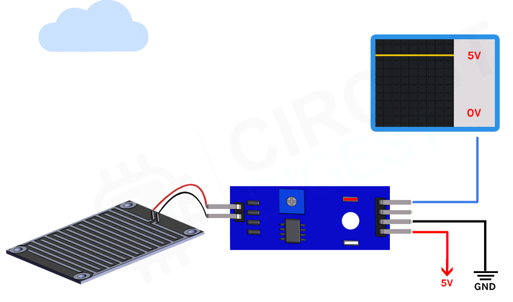

## What is Arduino?
Arduino is an open-source electronics platform based on easy-to-use hardware and software. Arduino boards are able to read inputs - light on a sensor, a finger on a button, or a Twitter message - and turn it into an output - activating a motor, turning on an LED, publishing something online.

## Brief
This repository contains the code of 4 mini projects made on Arduino. The physical structure of all the 4 projects will be explained through this [README.md](https://github.com/Annarhysa/Arduino-Projects/blob/main/README.md)

This is the list of all the projects in this repository 

1. Rain Detection Using Arduino And Raindrop Sensor
2. Gas Detection Using Arduino And Gas Sensor
3. LED Controlling System Using Arduino And Bluetooth Modules
4. Blinking of LED Using WiFi Mode (Node MCU)

## 1. Rain Detection Using Arduino And Raindrop Sensor
Rain sensor is one of the kind of switching device which is used to detect rainfall. It is a board on which nickel is used to coat lines on the board. It works on the principle of resistance. This module allows us to measure moisture via analog output pins and it provides a digital output when the threshold of moisture is crossed. As raindrops are collected on the circuit board, they create path of parallel resistance.

 

The sensor is a resistor dipole that shows less resistance when dry. When there are water droplets present, it reduces the resistance because water is a conductor of electricity and presence of water connects nickel lines in parallel, therby reducing resistance and volatge drop across it.\
We have used the Arduino IDE to code the Arduino and setting the threshold for the rain sensor. The circuit diagram for the same is as follows:

 

 

## 2. Gas Detection Using Arduino And Gas Sensor

While LPG is an essential need of every household, its leakage could lead to a disaster. To alert on LPG leakage and prevent any mishappening there are various products to detect the leakage. Here we have developed an Arduino based LPG gas detector alarm. If gas leakage occurs, this system detects it and makes an alert by buzing the buzzer attached with the circuit.\
A LPG gas sensor module is used to detect LPG Gas. When LPG gas leakage occurs, it gives a HIGH pulse on its DO pin and arduino continuously reads its DO pin. When Arduino gets a HIGH pulse from LPG Gas module it shows “LPG Gas Leakage Alert” message on serial monitor and activates buzzer which beeps again and again until the gas detector module doesn't sense the gas in environment. When LPG gas detector module gives LOW pulse to arduino, then LCD shows “No LPG Gas Leakage” message.\

The circuit diagram is as follows: 

  

#### Working of the Gas Sensor Module

The resistance of the sensor is different depending on the type of the gas. The smoke sensor has a built-in potentiometer that allows you to adjust the sensor digital output (D0) threshold. This threshold sets the value above which the digital pin will output a HIGH signal. 

 

The voltage that the sensor outputs changes accordingly to the smoke/gas level that exists in the atmosphere. The sensor outputs a voltage that is proportional to the concentration of smoke/gas.\
In other words, the relationship between voltage and gas concentration is the following:
- The greater the gas concentration, the greater the output voltage
- The lower the gas concentration, the lower the output voltagesmokepicture

The output can be an analog signal (A0) that can be read with an analog input of the Arduino or a digital output (D0) that can be read with a digital input of the Arduino.